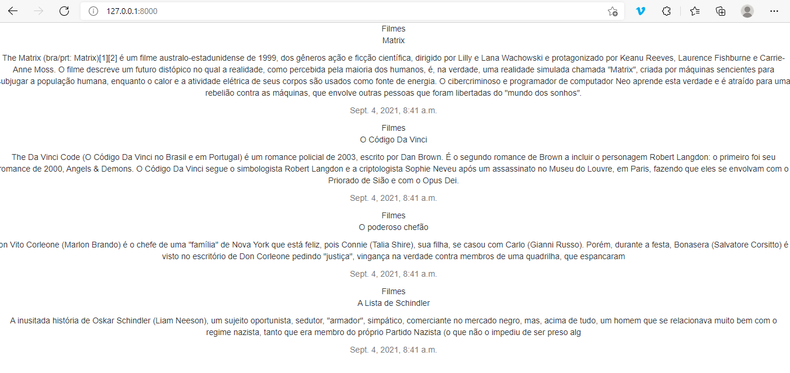
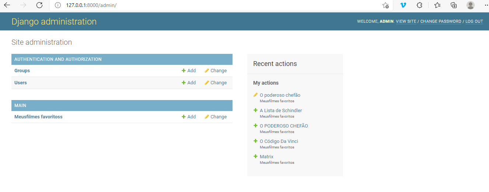

# Orientações para execução

- Os diretórios estão prontos e estruturados
- Com o Django instalado, dispare o servidor
  python manage.py runserver
- No home já vai listar os filmes
    http://127.0.0.1:8000/
    
- Para acessar a area administrativa, vá em
      http://127.0.0.1:8000/admin/
      
      user: admin
      senha: 123
