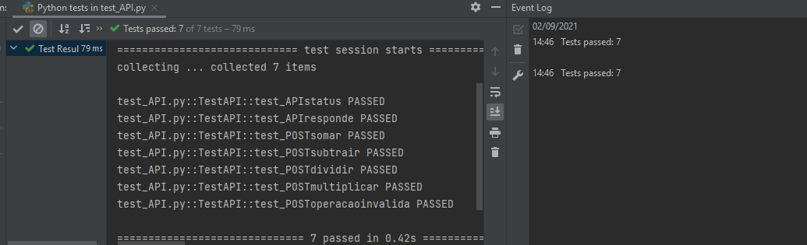

# Orientações para execução dos testes

- Sequência de testes bem legal e didática
- Salve em um diretório o arquivo API.py
- execute no terminal>>    uvicorn API:app --reload (apartir do mesmo diretório que está o arquivo)
- Se quiser enviar requisições, pode usar o Jupyter Notebook. Tem um modelo de arquivo no diretório

## Testes unitários
- Usei o pytest
- O arquivo está no diretório também
- A proposta do teste é enviar as possibilidades do serviço
- Executei por dentro do Pycharm e o resultado foi este. Pode ir alterando os valores para retornar com falha também.
 
