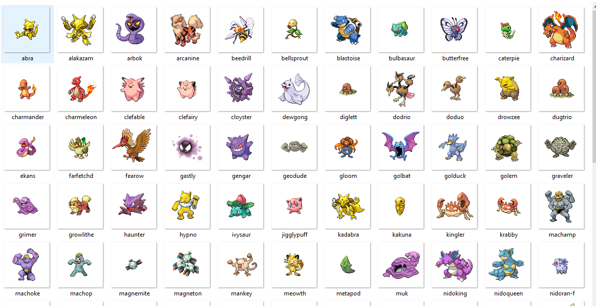

# Execução de Scraper assincrono

### No arquivo de execução concorrente estou utilizando asyncio
- Requisitamos a API pokemon
- buscamos o nome e a imagem do pokemons
- limitamos a busca para 100 pokemons(urls)
- salvamos as imagens em um diretorio

### No arquivo paralelo utilizo a biblioteca multiprocessing e BeautifulSoup
- Usamos um Pool limitado a 20
- Montamos uma lista de 10 urls
- Com BeautifulSoup extraimos o html5lib
- capturamos o titulo das páginas
- printamos o titulo das páginas
